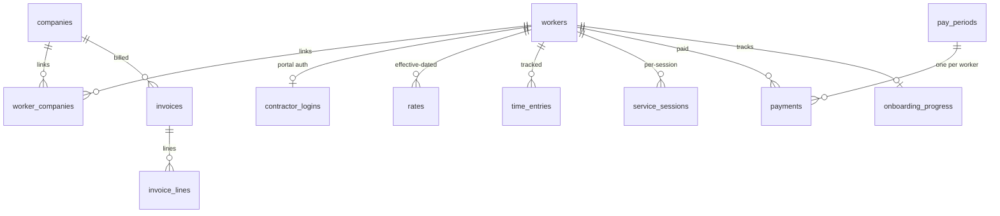

# Data model

The app persists everything to **PostgreSQL via Supabase**, in the `public` schema, with
**Row-Level Security (RLS) enabled on every table**. The full DDL lives in
`supabase/migrations/00000000000001_baseline_abc_schema.sql` (squashed baseline); later
migrations add the per-session billing path, coverage targets, AR columns, and prod-parity
columns. The TypeScript row shapes the app actually reads and writes live in
`src/db/queries/*.ts` (e.g. `src/db/queries/payroll.ts`, `workers.ts`, `invoicing.ts`).

> ⚠️ **This database is SHARED with the production live apps.** abc-helper-app *replaces* the
> original apps and runs on their DB, so schema changes here must be **additive only** and must
> match prod's existing object names (hence some legacy names below). See
> [Shared-prod conformance](./shared-prod-conformance.md).

## Tables by group

Key columns and purpose only — not exhaustive DDL. See the baseline migration for the
complete column list, constraints, indexes, and foreign keys.

### Identity & access

| Table | Key columns | Purpose |
|---|---|---|
| `companies` | `kind` (`employer`/`client`), `name`, `status`, `hubstaff_org_id`, `contacts` (jsonb), `tax_id` | Orgs. `employer` = the agency time is tracked under; `client` = who gets billed. |
| `admin_users` | `user_id` (→`auth.users`), `email`, `role` (`owner`/`admin`), `can_countersign` | Back-office staff. Last `owner` can't be removed/demoted (trigger). |
| `admin_companies` | `admin_email`, `company_id` | Scopes a non-owner admin to specific companies. |
| `contractor_logins` | `worker_id` (PK), `auth_user_id`, `email`, `status` (`active`/`revoked`) | Maps a Supabase `auth` user to a `worker` for portal access. |
| `workers` | `first_name`/`middle_name`/`last_name`, `match_key` (generated), `hire_date`, `payout_method`, `health_allowance_eligible`, `thirteenth_month_eligible`, profile/payout fields | The contractor. `match_key` powers name-based Hubstaff attribution. |

### Engagement & rates

| Table | Key columns | Purpose |
|---|---|---|
| `worker_companies` | `worker_id`, `company_id`, `contract` (`FT`/`PT`/`PH`/`PS`/`PHS`), `pay_basis`, `bill_rate_usd`, `session_rate_usd`, `hubstaff_user_id`, `status`, `weekly_hours` | The engagement: links a worker to a company with contract type, billing/pay basis, and the Hubstaff id used for time matching. |
| `rates` | `worker_id`, `company_id`, `amount_php`, `effective_start`, `effective_end`, `period_basis` | Effective-dated PHP pay rate. `effective_end` NULL = open; resolved against the period (see [Money core spec](./money-core-spec.md)). |

The `contract_type` enum is `FT`, `PT` (baseline), `PH`, `PS` (migration `00000000000013`), and
`PHS` (migration `00000000000019_prod_parity_columns.sql`).
For `PHS`, `worker_companies.pay_basis` (`hourly` / `per_session`) decides how pay is computed;
an unset `pay_basis` is paid nothing (never guessed).

### Time & sessions

| Table | Key columns | Purpose |
|---|---|---|
| `time_entries` | `company_id` (the **employer**), `worker_id` (nullable until attributed), `source_name`, `work_date`, `tracked_seconds`, `pto_seconds`, `activity_pct`, `approval` (`pending`/`approved`/`rejected`), `import_batch_id` | One row per worker-per-day of tracked time. Conflict key `(company_id, source_name, work_date)` makes imports idempotent. See [Hubstaff integration](./hubstaff.md). |
| `service_sessions` | `company_id` (the **client**), `worker_id`, `session_date`, `session_type`, `units`, `approval`, `child_initials`, `eiid`, `external_ref` | One row per visit/session for flat-fee billing. Recorded directly against the client (unlike `time_entries`). |

Only **approved** time/sessions count toward pay and billing.

### Pay

| Table | Key columns | Purpose |
|---|---|---|
| `pay_periods` | `company_id`, `period_start`, `period_end`, `pay_date`, `state` (`open`/`locked`/`paid`), `expected_hours_ft`/`_pt`, `locked_at` | Semi-monthly period. State machine: `open` → `locked` → `paid` (see [Pay pipeline](./pay-pipeline.md)). |
| `payments` | `pay_period_id`, `worker_id`, `gross_php`, `health_allowance_php`, `thirteenth_month_php`, `pdd_lunch_php`, `bonus_php`, `misc_items` (jsonb), `deduction_php`, `net_php`, `units`, `pay_basis`, `contract`, `fx_rate`, `wise_transfer_id`, `wise_dates` (jsonb), `wise_locked_at`, `status` (`payment_status`), `payout_method` | One computed payment per `(pay_period_id, worker_id)`. Once `wise_locked_at` is set, a trigger blocks edits to the money columns. |

`payments.deduction_php` is the **shared-prod column name for the informational performance
shortfall** (rate − gross) — it is **never** subtracted from `net_php`. Real deductions live in
`misc_items` (`kind=deduction`). See the [Money columns](#money-columns) note and
[Pay pipeline](./pay-pipeline.md). Funding columns (`funded_at`/`funded_by`/`fund_error`) exist
for prod parity but are not written by this app.

### Billing

| Table | Key columns | Purpose |
|---|---|---|
| `invoices` | `company_id`, `period_start`/`period_end`, `invoice_no`, `status`, `subtotal_usd`, `total_usd`, `markup_pct`, `amount_received_usd`, `received_on`, `payment_ref` | Client invoice. `invoice_no` is allocated atomically; AR columns (`amount_received_usd`/`received_on`/`payment_ref`) track receipt. See [Invoicing](./invoicing.md). |
| `invoice_lines` | `invoice_id`, `worker_id`, `kind` (`hourly`/`session`), `worked_hours`, `bill_rate_usd`, `sessions_count`, `session_rate_usd`, `amount_usd` | Snapshotted line; `amount_usd` is authoritative. Hourly and session lines can coexist on one invoice. |

### Onboarding & documents

| Table | Key columns | Purpose |
|---|---|---|
| `onboarding_progress` | `worker_id` (PK), `current_stage`, `stage1/2/3_complete`, `completed_at`, `extra_documents` (jsonb) | Per-worker onboarding state. `completed_at` drives `is_onboarded()`. |
| `onboarding_signatures` | `worker_id`, `agreement_kind`, `doc_version`, `doc_sha256`, `signed_legal_name`, `signature_method`, `signature_data`, `ip_address`, `status` | Tamper-evident e-sign ledger; evidentiary columns are immutable (trigger). `signature_data` is **PHI** (encrypted). |
| `onboarding_agreements` | `worker_id`, `agreement_kind`, prefill `f_*` fields, countersign columns (`countersigned_by`/`countersigned_name`/`countersign_method`/`countersign_data`/`countersigned_at`) | Per-agreement prep + admin countersignature. |
| `documents` | `worker_id`, `company_id`, `kind` (`document_kind`), `review_status` (`pending`/`approved`/`needs_replacement`/`waived`/`deferred`), `storage_path`, `issued_on`/`expires_on`/`defer_until` | Uploaded hiring/compliance docs. See [Onboarding & documents](./onboarding-documents.md). |
| `agreement_templates` | `kind` (PK), `title`, `version`, `body` | Editable agreement text by kind. |

### Config & ops

| Table | Key columns | Purpose |
|---|---|---|
| `portal_settings` | singleton (`id=1`), `editable_fields` (jsonb), `onboarding_config` (jsonb) | Which profile fields contractors may edit + the onboarding document/agreement config. |
| `coverage_targets` | `worker_id`, `company_id` (NULL = employer-wide), `period_kind` (`weekly`/`semi_monthly`), `target_hours`, `target_sessions`, `effective_from`/`effective_to` | Expected work per contractor per period, so the Overview can flag coverage gaps. Overrides `worker_companies.weekly_hours`. |
| `worker_tools` | `worker_id` (PK), `requested` (jsonb), `enc` (encrypted creds), `provisioned_at`, `popup_pending` | 3rd-party tool credentials. `enc` is encrypted with `app_secrets.tools_enc_key`; persistent re-readable model (migration `00000000000020`). |
| `api_tokens` | `provider` (PK), `refresh_token`, `access_token`, `access_expires_at` | Cached OAuth tokens (e.g. the Hubstaff access/rotating-refresh token). |
| `app_secrets` | `key` (PK), `value` | Service-role key→value store: `cron_secret`, `tools_enc_key`, `app_base_url`, etc. RLS denies non-service access. |
| `audit_log` | `company_id`, `actor`, `action`, `entity`, `detail` (jsonb) | Append-only event log. |

## Row-Level Security

RLS is enabled on every table; the contractor portal relies on it directly. Two SECURITY DEFINER
helpers scope contractor access:

- **`my_worker_id()`** — returns the `worker_id` for the current `auth.uid()` from an **active**
  `contractor_logins` row, or NULL. Contractor read policies on `workers`, `payments`,
  `time_entries`, `service_sessions`, `documents`, `onboarding_*`, etc. require
  `worker_id = my_worker_id()`.
- **`is_onboarded()`** — true once the worker's `onboarding_progress.completed_at` is set. The
  **financial** contractor reads (`payments`, `time_entries`, `service_sessions`, `pay_periods`)
  additionally require `is_onboarded()`, so an in-flight contractor sees no pay/time data.

Admin policies use `is_owner()`, `is_admin()`, `is_company_admin(cid)`,
`my_admin_company_ids()`, and `admin_can_see_worker(wid)` for company scoping. Note that
**admin server actions go through the Supabase service client after an explicit role check in
code** — for those writes RLS is *not* the gate; the app's authorization is. See
[Architecture](./architecture.md).

## Money columns {#money-columns}

PHP money is stored as **`numeric(12,2)` major units** (pesos). The app's pure pay engine works
in **integer centavos** (a branded type) and converts at the DB boundary in the `src/db/`
mappers — see [Money core spec](./money-core-spec.md). USD billing columns are `numeric(_,2)`
dollars.

`fx_rate` is reference only (contractors are paid in PHP). And again: `payments.deduction_php`
is the shared-prod name for the **informational performance shortfall**, *not* a real
deduction — real, subtracted deductions are `misc_items` rows with `kind=deduction`. See
[Pay pipeline](./pay-pipeline.md).
