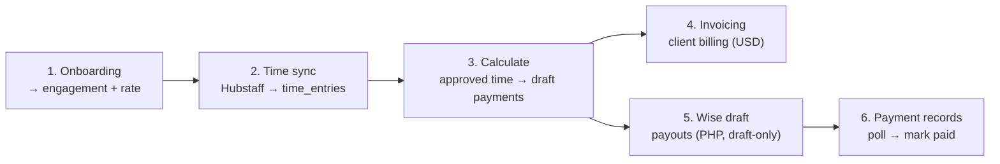

# Pay pipeline (end to end)

This is the spine of the app: how a contractor goes from hired to paid. Each stage is a set
of Server Actions (see [Architecture overview](./architecture.md)) backed by a service and
query module. The arithmetic each stage relies on is specified in
[Money core spec](./money-core-spec.md).

Money is **integer centavos** throughout payroll (PHP); invoicing is **integer cents** (USD).
Periods are **semi-monthly, in arrears** — `periodFor(date)` in `src/lib/dates/periods.ts`:
days 1–15 pay at end of month, days 16–EOM pay on the 15th of the next month.

---

## 1. Onboarding → engagement

A contractor becomes payable when they have an **engagement** (a `worker_companies` row
linking the worker to the employer company) and an effective-dated **rate**.

- Entry: `hireContractor()` in `src/server/actions/contractors.ts` — a transactional
  orchestrator that creates the worker, the `worker_companies` link, the rate, an optional
  portal login, and staged onboarding agreements. Lighter paths: `addContractor()`,
  `saveWorkerProfile()`.
- An engagement carries `contract` and (for PHS) `pay_basis`, which together select the **pay
  model** (see stage 3).
- Rates are effective-dated and written by `saveRate()` (`src/server/actions/payroll.ts` →
  `src/db/queries/rates.ts`): a same-day rate replaces in place; otherwise the prior open rate
  is closed (`effective_end`) and a new row inserted. Resolution per period is
  `resolveRate()` (`src/lib/pay/rates.ts`) — see [Money core spec §5](./money-core-spec.md).

**Contract types** (`src/lib/pay/expected-hours.ts`):

| Contract | Pay model | Basis |
|---|---|---|
| `FT` / `PT` | `salaried` | worked ÷ expected hours (ratio, capped at 5) × rate |
| `PH` | `per_hour` | worked hours × rate |
| `PS` | `per_session` | approved sessions × rate |
| `PHS` | `per_hour` **or** `per_session` | discriminated by `pay_basis` |

> **PHS safety gate:** a `PHS` engagement with `pay_basis = null` resolves to `'unset'` and is
> **unpayable** (null gross, row blocked from lock) until a basis is chosen. This is enforced
> when saving the link.

## 2. Time sync (Hubstaff → `time_entries`)

- Entry: `importHubstaffTime()` in `src/server/actions/hubstaff-sync.ts`, orchestrated by
  `syncHubstaffForCompany()` in `src/server/hubstaff/service.ts`. Pure transforms live in
  `src/lib/hubstaff/`.
- It pulls per-member daily totals (activities + PTO) from the Hubstaff API and **upserts**
  `time_entries` on `(company_id, source_name, work_date)` — the same key CSV import uses, so
  re-running is idempotent. Imported rows land in `approval = 'pending'`.
- Rows whose Hubstaff name doesn't match a worker land with `worker_id = null` and are surfaced
  as **unmatched** (never silently dropped); attribution resolves them by name at calc time.
- Already-decided days (`approved`/`rejected`) are protected from being overwritten by a re-sync.

Stored per row: `tracked_seconds`, `pto_seconds`, `work_date`, `approval`, `import_batch_id`.
Time is **approved** (admin action) before it counts toward pay.

## 3. Calculate (approved time → draft payments)

This is where the [money core](./money-core-spec.md) runs.

- Entry: `calculatePeriodDraft()` in `src/server/actions/payroll.ts`, orchestrated by
  `calculateDraft()` in `src/server/payroll.ts`. The `/process` (calculate) and `/payroll`
  screens drive the **same** engine — there is no separate math path.
- Orchestration: fetch approved time + roster + rates + last payout methods + per-session
  units → **attribute** unmatched time by name (shared matcher) → build a statement per worker
  → snapshot prior rows (undo) → prune stale rows → upsert drafts.
- Per-worker math is the pure `calcContractorRow()` (`src/lib/pay/calc.ts`); statements are
  assembled by `buildStatements()` (`src/lib/payroll/mappers.ts`). All outputs are centavos;
  `centavosToPhp()` converts at the DB boundary (DB stores PHP `numeric(12,2)`).

What a payment row carries (selected columns — names match the shared-prod schema):

| Column | Meaning |
|---|---|
| `gross_php` | ratio/units × rate (salaried capped at the rate — no overtime premium) |
| `health_allowance_php`, `thirteenth_month_php` | eligibility-gated allowances |
| `pdd_lunch_php`, `bonus_php` | manual per-period add-ons |
| `misc_items` (jsonb) | manual items; `kind: 'deduction'` subtracts, others add |
| `deduction_php` | **informational performance shortfall** (rate − gross); not subtracted from net |
| `net_php` | gross + allowances + add-ons + misc |
| `units`, `pay_basis`, `contract` | per-row provenance (full prod column parity) |
| `fx_rate`, `payout_currency='PHP'`, `payout_amount` | payout metadata (FX is reference-only) |

> `deduction_php` is the shared-prod column name for the **performance shortfall** (a worker
> who worked below expected hours). It is surfaced in the UI but is **not** a real deduction —
> real deductions are `misc_items` of `kind: 'deduction'`. See
> [Prod conformance plan](./PROD-CONFORMANCE-PLAN.md).

**Pay period states** (`pay_periods`): `open` → `locked` → `paid`. Draft saves require `open`;
locking blocks rows with no rate and never persists `net == null` rows; a recalc snapshots
existing rows first so manual overrides can be restored.

## 4. Invoicing (client billing, USD)

Independent of payouts — this bills the **client** company for work, in USD.

- Entry: `previewInvoice()` (no persistence) / `generateInvoice()` in
  `src/server/actions/invoicing.ts`; pure compute in `computeInvoice()`
  (`src/lib/invoicing/compute.ts`).
- Two line kinds per worker: **hourly** (employer-tracked worked hours × `bill_rate_usd`,
  excluding PTO) and **session** (approved sessions × `session_rate_usd`, flat per session).
- Markup (`markup_pct`) is applied once to the combined subtotal; an annual `invoice_no` is
  allocated; invoice + lines are persisted atomically. Invoice status: `draft → sent → paid → void`.

## 5. Wise payout (PHP, draft-only)

> **Invariant (ADR-0007): no money ever moves from the app.** Wise transfers are created as
> **quotes + drafts only**; an owner funds them manually in the Wise UI. No funding endpoint is
> ever called — `scripts/guardrails.mjs` enforces this in pre-push and CI.

- Entry: `wiseDraft(paymentIds)` (owner-only) in `src/server/actions/wise.ts`, via
  `src/server/wise/service.ts` and the `src/server/wise/client.ts` API client.
- Per payment: resolve the worker's Wise recipient → get a quote (PHP → recipient currency) →
  create a **draft** transfer → write `wise_transfer_id` and `fx_rate` back to the payment row.
- `wisePoll()` reconciles transfer status over time; `wiseMatch()` links a transfer
  to a payment when auto-match fails.

## 6. Payment records

Two lifecycles run in parallel — don't conflate them:

- A **payment**'s `status` is `draft` (from Calculate) → `sent` (Wise reconcile marks it);
  `queued`, `failed`, and `reconciled` are the other `payment_status` values. Note
  `markPaymentsPaid()` sets `status = 'sent'`, **not** a `paid` status.
- A **pay period**'s `state` is `open → locked → paid`, reaching `paid` once all its payment rows
  are `sent`/`reconciled`.

The payment rows produced in stage 3 carry through stages 5–6; `src/db/queries/payroll.ts` holds
the lock/unlock/mark-paid helpers and the snapshot row type used for undo.

---

## Entry-point map

| Stage | Action | Service | Pure logic | Queries |
|---|---|---|---|---|
| 1 Onboarding | `hireContractor`, `saveRate` | — | `resolveRate` | `workers`, `rates`, `onboarding` |
| 2 Time sync | `importHubstaffTime` | `syncHubstaffForCompany` | `lib/hubstaff/*` | `hubstaff`, `time` |
| 3 Calculate | `calculatePeriodDraft` | `calculateDraft` | `calcContractorRow`, `buildStatements` | `payroll` |
| 4 Invoicing | `generateInvoice` / `previewInvoice` | — | `computeInvoice` | `invoicing` |
| 5 Wise draft | `wiseDraft` / `wisePoll` | `src/server/wise/service.ts` | `lib/wise/*` | `wise` |
| 6 Payments | lock / unlock / mark-paid | — | — | `payroll` |

Per-domain deep dives (Hubstaff, Wise, Invoicing, Onboarding & documents, Coverage & reports,
Portal) are the next documentation phase — see `audit/DOC-BACKFILL-PLAN.md`.
